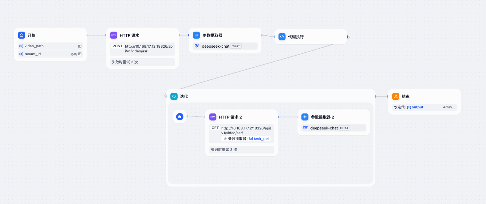
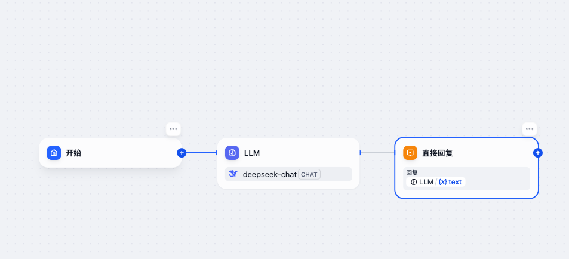
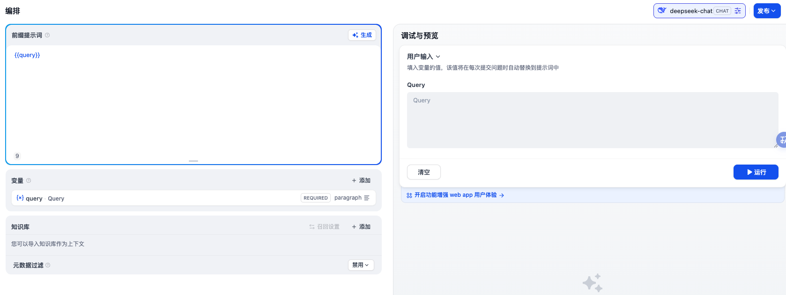
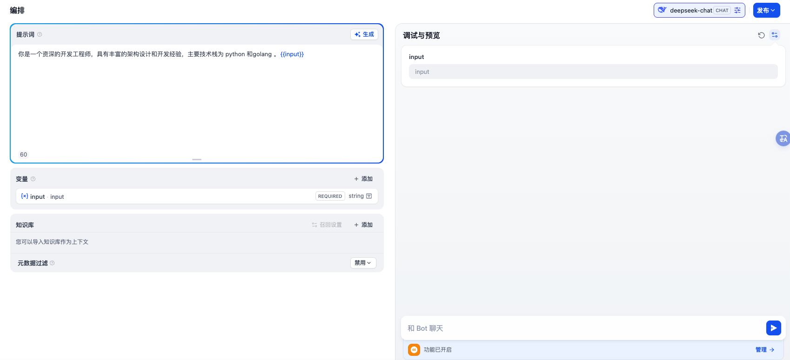
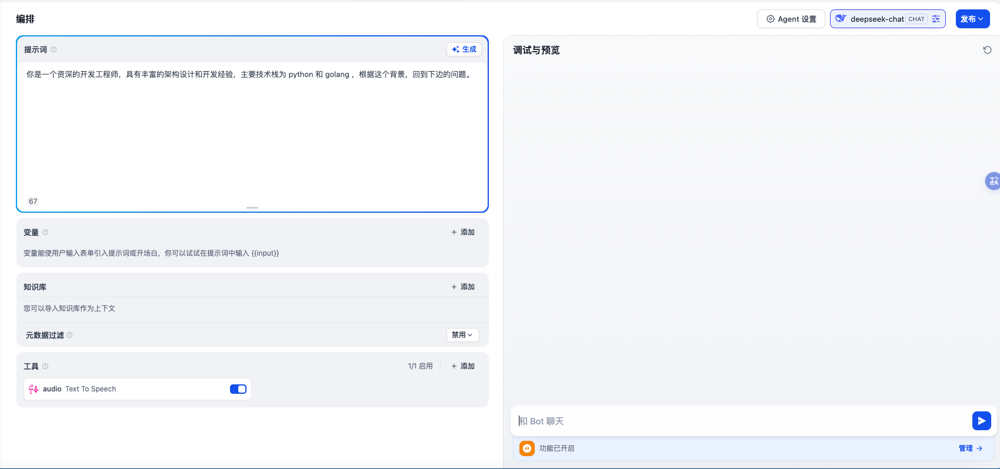
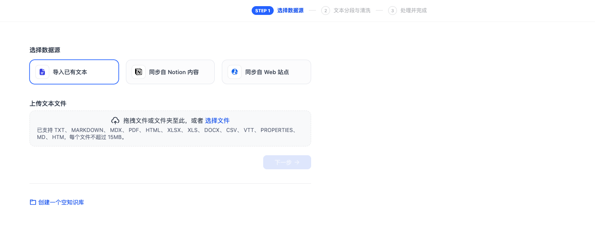

## Dify 是什么？—— 重新定义 AI 应用开发

Dify 是一款开源的生成式 AI 应用开发平台，旨在帮助企业及开发者**快速构建、部署和管理基于大语言模型（LLM）的智能应用**。它由来自阿里云、字节跳动、微软的技术专家于 2021 年底在杭州创立，其核心理念是通过 “低代码化”和“开箱即用” 的设计，大幅降低 AI 应用开发门槛。

关键发展里程碑：
2023 年 3 月：正式发布 1.0 版本，推出低代码开发平台、模型市场（支持 GPT-3.5、LLaMA 等）和应用商店（含 20+预制模板）

2023 年 9 月：开源核心框架 Dify Core，启动开发者社区建设

2024 年 1 月：发布国际版 Dify Global，支持多语言和海外模型（如 Claude）

2024 年 3 月：完成 B 轮融资 1 亿美元，GitHub 星标超 22k，跻身全球 LLM 工具前三

2025 年初：推出 AI Workflow 可视化编排功能，支持 100+节点工作流设计，48 小时内用户创建超 100 种复杂流程

如今，Dify 已成为全球增速最快的 AI 开源项目之一，托管超 20 万个 AI 应用，私有化部署量超 400 万实例，被生命科学、零售、制造业企业广泛采用

```
CEO张路宇的观点：“未来的编程，可能就是编flow” —— 道出Dify通过可视化工作流革新开发范式的愿景。
```

## Dify 核心概念

### 五大类型应用

- **工作流** 核心应用类型，可通过可视化拖拽界面编排流程，配置 prompt、上下文和 工具插件。
  

- **chatflow** 在工作流应用基础上增加了实时对话，结合用户对话反馈实时选择调整回复策略。
  

- **文本生成** 简单的单轮文本生成，支持 RAG 知识库的调用。
  

- **聊天助手** 简单的聊天应用，可预设 prompt 和调用 RAG 知识库。
  

- **Agent** 增加了插件工具调用的聊天助手。
  

### 原生集成 RAG

Dify 原生集成了 RAG 的能力，支持上传文档、notion、web 网页抓取等数据做 RAG 知识库。当用户提问时，系统先检索相关知识片段，再喂给 LLM 生成精准答案，减少“幻觉”错误。

Dify 默认使用 weaviate 向量库，支持 milvus 等其他向量库。



### 丰富的内置工具和插件机制

Dify 中可将创建好的应用发布为「工具」供其他用户或其他应用使用，这样充分的提高了我们应用的丰富度和灵活性。

它内置了 50+ 开箱即用的工具，并且还有官方的工具市场，我们可以将应用发布上去供别人使用。除此之外，支持从本地和 github 直接安装导入。

Dify 将模型、工具、Agent 策略和插件集合 统称为 「插件」，并有官方维护的插件市场。

这些插件进一步丰富了 Dify 的能力和生态。

### API

所有应用类型除了页面，都可以通过 API 访问使用。

## 问题不足

- 工作量逻辑能力欠缺
- 原生应用账户权限管理缺失
- 所有的工具都需要配置 额外的 key
